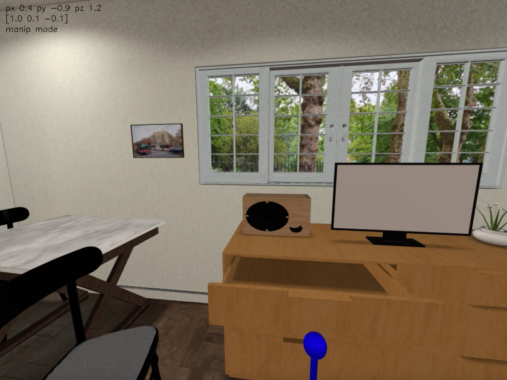

# Viewer

### Overview

We developed an easy-to-use iGibson-human interface called **Viewer** for users to inspect and interact with our scenes and objects. The Viewer will automatically pop up if you use `gui` or `iggui` mode in `Simulator`.

To play with an example of viewer, you can run the following command:

```bash
python -m igibson.examples.demo.mouse_interaction
```


On the top left corner, you can see `px 0.4 py -0.9 pz 1.2`, which indicates the camera position, `[1.0, 0.1, -0.1]`, which indicates the camera orientation, and `manip mode`, which indicates the current control mode you are in (explained below).

Keyboard control includes the following
- `W`, `A`, `S`, `D`: translate forward/left/backward/right
- `Q`, `E`: rotate left/right
- `M`: choose between different control mode (navigation, manipulation and planning)
- `R`: start/stop recording
- `P`: pause/resume recording
- `H`: show help menu
- `ESC`: exit

We have three control modes (navigation, manipulation and planning) and the mouse control is different for each control mode. You may switch between these control modes by pressing `M`.

Mouse control in navigation mode
- Left click and drag: rotate camera
- CTRL + left click and drag: translate camera
- Middle click and drag: translate camera closer/further away in the viewing direction

Mouse control in manipulation mode
- Left click and drag: create ball-joint connection to the clicked object and move it
- Middle click and drag: create fixed-joint connection to the clicked object and move it
- CTRL + click and drag: move the object further/closer

Mouse control in planning mode
- Left click and drag: create (click), visualize (drag) and plan / execute (release) a base motion subgoal for the robot base to reach the physical point that corresponds to the clicked pixel
- Middle click: create create, and plan / execute an arm motion subgoal for the robot end-effector to reach the physical point that corresponds to the clicked pixel

In manipulation and planning modes, a visual indicator will be visualized in the `Viewer` to assist control (e.g. the blue sphere at the bottom in the image above).

Most of the code can be found in [igibson/render/viewer.py](https://github.com/StanfordVL/iGibson/tree/master/igibson/render/viewer.py).
